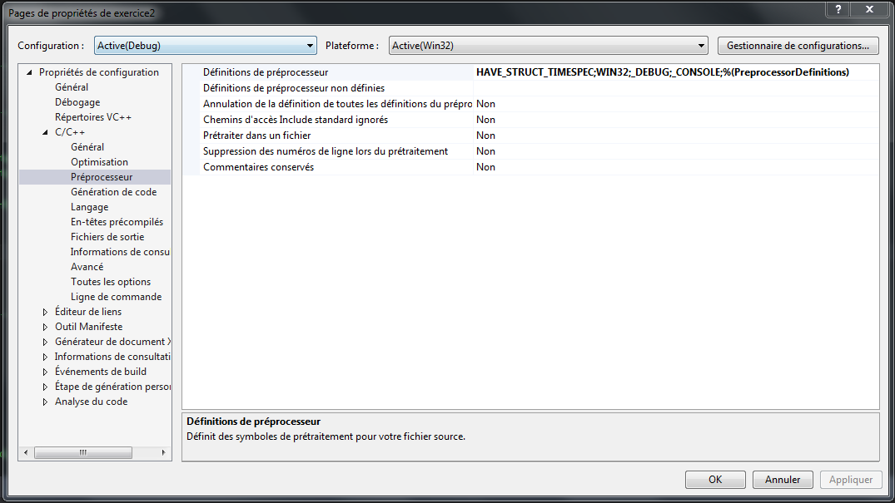

Multithreading Benchmarks
=========================

Here's the stuff.

- [Homepage](https://github.com/CorkyMaigre)
- [Source files](https://github.com/CorkyMaigre/multithreading-benchmarks)
- [Website](http://www.corkymaigre.be/)

Table of contents
=================

- [HEHLan](#HehLan)
- [Table of contents](#table-of-contents)
- [Configuration](#configuration)
- [Benchmarks](#benchmarks)
	- [Benchmark 1](#benchmark-1)
	- [Benchmark 2](#benchmark-2)
	- [Benchmark 3](#benchmark-3)
	- [Benchmark 4](#benchmark-4)
- [Contribute](#contribute)
- [Bugs](#bugs)

Configuration
=============

First of all, you have to set that we use pthread library by typing 'pthreadVC2.lib' into the additional dependencies found at
'Property' > 'Links Editor' > 'Additional Dependencies' as shown on the picture below.

Then you need to type 'HAVE_STRUCT_TIMESPEC' into the preprocessor definition found at
'Property' > 'C/C++' > 'Preprocessor' > 'Preprocessor Definition' as shown on the picture below.

Benchmarks
==========

Benchmark 1
-----------

Benchmark 2
-----------

Benchmark 3
-----------

Benchmark 4
-----------

Contribute
==========

No one has contribute to the project.

Bugs
====

No bugs encountered yet.

