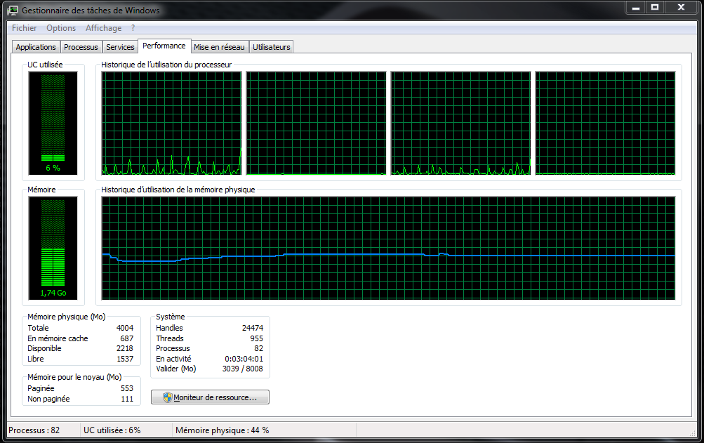
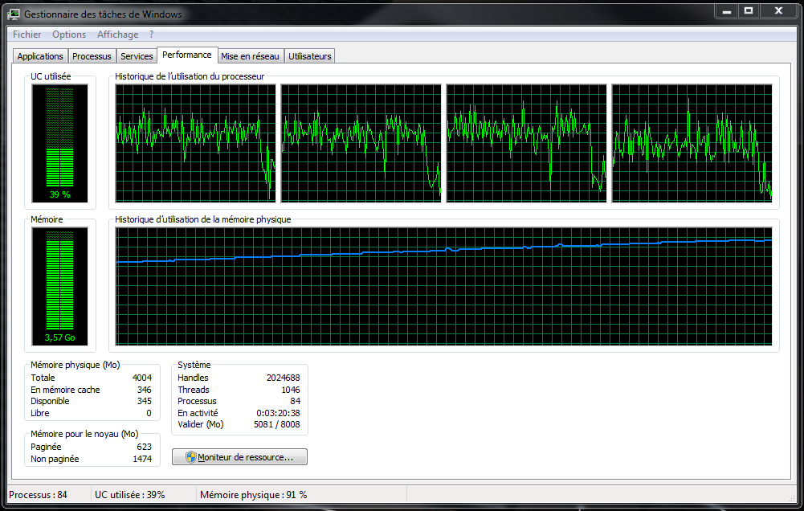
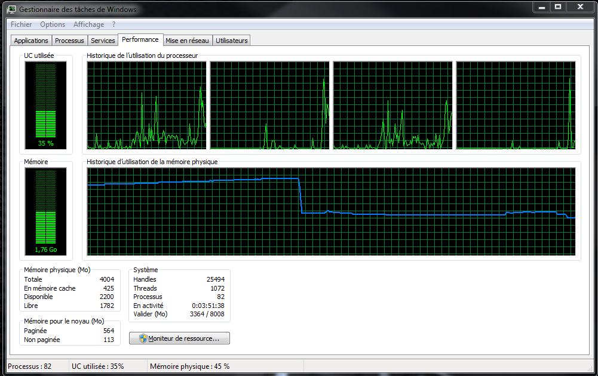
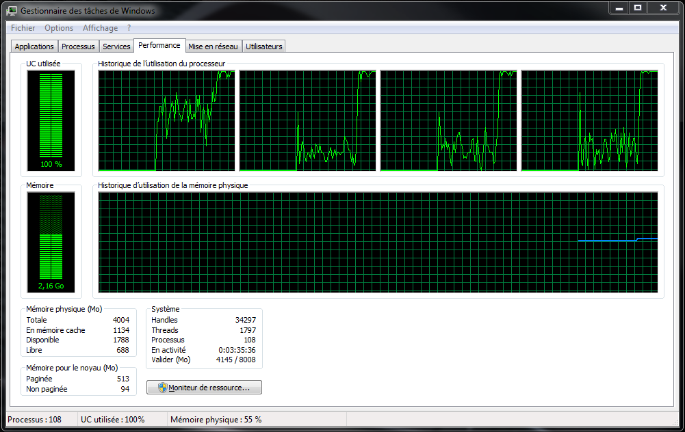
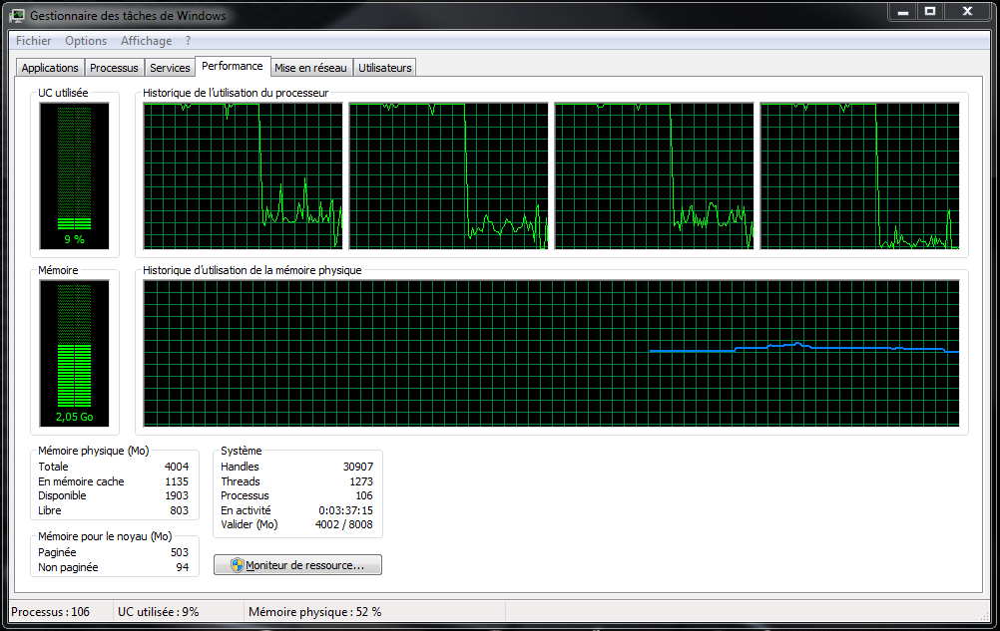

Multithreading Benchmarks
=========================

This project intended to compare the performance of a console application using CPU & GPU programming.
The console application consisted of doing a square matrix multiplication via several methods :
- [CPU Programming]
	- [Sequential code]
	- [Multithreading code (one thread per cell of the result matrix)]
	- [Multithreading code (one thread per row of the result matrix)]
	- [Multithreading code (each cell of the result matrix is assigned to one of the *n* threads)]
- [GPU Programming]
Each programming method was compared each other by doing a benchmark on the elapsed time for the computation.

My personal information :
- [Homepage](https://github.com/CorkyMaigre)
- [Source files](https://github.com/CorkyMaigre/multithreading-benchmarks)
- [Website](http://www.corkymaigre.be/)

Table of contents
=================

- [Introduction](#introduction)
- [Table of contents](#table-of-contents)
- [Configuration](#configuration)
	- [Hardware Specifications](#hardware-specifications)
	- [IDE Configuration](#ide-configuration)
- [Benchmarks](#benchmarks)
	- [Benchmark 1](#benchmark-1)
	- [Benchmark 2](#benchmark-2)
	- [Benchmark 3](#benchmark-3)
	- [Benchmark 4](#benchmark-4)
- [Conclusion](#conclusion)
- [Contribute](#contribute)
- [Bugs](#bugs)

Introduction
============

Configuration
=============

Hardware Specifications
-----------------------

Using an ASUS X93S Series laptop.

Charasteristics | Description
----------------|------------
Processor		| Intel Core i5 2430M 2.4 GHz ~ 2.9 GHz
Operating System| Windows 7 Home Premium
Chipset			| Intel HM65 Express
Memory			| DDR3 1333 MHz SDRAM, 4096 MB, (1 x 4096 MB)
Display			| 18.4" 16:9 Full HD (1920x1080) LED Backlight
Graphic			| NVIDIA® GeForce® GT 540M with 1GB DDR3 VRAM
Storage			| 1 TB 7200 rpm
Optical Drive	| DVD player
Card Reader		| Card reader ( SD/ SDHC/ MS/ MS Pro/ MMC)
Webcam			| 0.3 Mega Pixel Fixed web camera
Networking		| Integrated 802.11 b/g/n, Bluetooth™ V2.1+EDR, 10/100/1000 Base T
Interface		| 1 x Microphone-in jack, 1 x Headphone-out jack, 1 x VGA port / Mini D-sub 15 pins for external monitor, 1 x USB 3.0 port, 3 x USB 2.0 ports, 1 x RJ45 LAN Jack for LAN insert, 1 x HDMI
Audio			| Built-in Speakers And Microphone, SonicFocus, Altec Lansing® Speakers
Battery			| 6Cells : 5200 mAh 56 Whrs
Power Adapter	| Output : 19 V DC, 6.3 A, 120 W Input : 100 -240 V AC, 50/60 Hz universal
Dimensions		| 44.1 x 29.5 x 4.23 ~5.59 cm (WxDxH)
Weight			| 4.11 kg (with 6 cell battery)
Note			| Master HDD: 3.5” SATA, Second HDD: 2.5” SATA

IDE Configuration
-----------------

The IDE used is Visual Studio Community 2015.

First of all, you have to set that we use pthread library by typing 'pthreadVC2.lib' into the additional dependencies found at
'Property' > 'Links Editor' > 'Additional Dependencies' as shown on the picture below.

>**CAUTION**
> It is possible that you need to type 'HAVE_STRUCT_TIMESPEC' into the preprocessor definition found at
>'Property' > 'C/C++' > 'Preprocessor' > 'Preprocessor Definition' as shown on the picture below.
> Otherwise you will have this error message: Error C2011 'timespec' : redefinition of type 'struct'

Benchmarks
==========

All benchmarks presented here are resulted from one console application consisting of doing a matrix multiplication.
Each benchmark is computed for a specific use of threading.

Benchmark 1
-----------

This first benchmark is created by executing the sequential code with CPU in C++. The code uses dynamic arrays and a 'Matrix' structure.

Matrix Dimension|Number of cells|Elapsed Time 1|Elapsed Time 2|Elapsed Time 3|
----------------|---------------|--------------|--------------|--------------|
2	x 2			|4				| 0.000000 s   | 0.000000 s   | 0.000000 s   |
25	x 25		|625			| 0.000144 s   | 0.000106 s   | 0.000198 s   |
50	x 50		|2,500			| 0.001092 s   | 0.001143 s   | 0.001261 s   |
100 x 100		|10,000			| 0.007243 s   | 0.009130 s   | 0.010531 s   |
200 x 200		|40,000			| 0.069280 s   | 0.050119 s   | 0.096451 s   | 
500 x 500		|250,000		| 0.908748 s   | 0.976781 s   | 0.917461 s   |
1,000 x 1,000	|1,000,000		| 14.82270 s   | 14.90280 s   | 15.32160 s   |
1,500 x 1,500	|2,250,000		| 51.84170 s   | 53.78350 s   | 61.38590 s   |
2,000 x 2,000	|4,000,000		| 144.4250 s   | 144.3840 s   | 138.8950 s   |

Benchmark 2
-----------

The second benchmark is created by executing the parallel code with CPU in C++ using pthread.
The code uses dynamic arrays and a dynamic number of threads. Each cell in the result matrix is performed by one thread.

Matrix Dimension|Number of cells|Elapsed Time 1|Elapsed Time 2|Elapsed Time 3|
----------------|---------------|--------------|--------------|--------------|
2	x 2			|4				| 0.001818 s   | 0.000263 s   | 0.001539 s   |
25	x 25		|625			| 0.651238 s   | 0.641366 s   | 0.383544 s   |
50	x 50		|2,500			| 1.956470 s   | 1.784130 s   | 1.783190 s   |
100 x 100		|10,000			| 8.355190 s   | 8.410570 s   | 7.513020 s   | 
200 x 200		|40,000			| 32.00290 s   | 33.54810 s   | 34.70680 s   |  
500 x 500		|250,000		| 210.6790 s   | 212.8600 s   | 216.6650 s   |
1,000 x 1,000	|1,000,000		| 958.3180 s   | 918.7720 s   | 931.3840 s   |
1,500 x 1,500	|2,250,000		| 0.000000 s   | 0.000000 s   | 0.000000 s   | 
2,000 x 2,000	|4,000,000		| 0.000000 s   | 0.000000 s   | 0.000000 s   |

Before launching the console application for a square matrix of 1,000 x 1,000, the memory is low (but Visual Studio takes a big part of memory).

At the end of the console application for a square matrix of 1,000 x 1,000, the memory is full because all pointers take a lot of space and there are 1,000,000 of threads in memory.

When the application finished, all the memory is released.

>**NOTE**
> Not using the 'Cell' structure as in the benchmarks 3 and 4.

Benchmark 3
-----------

The third benchmark is created by executing the parallel code with CPU in C++ using pthread.
The code uses dynamic arrays and a dynamic number of threads. Each row in the result matrix is performed by one thread.

Matrix Dimension|Number of cells|Elapsed Time 1|Elapsed Time 2|Elapsed Time 3| 
----------------|---------------|--------------|--------------|--------------|
2	x 2			|4				| 0.000655 s   | 0.000203 s   | 0.000496 s   | 
25	x 25		|625			| 0.010548 s   | 0.011697 s   | 0.016335 s   | 
50	x 50		|2,500			| 0.022197 s   | 0.023205 s   | 0.029736 s   | 
100 x 100		|10,000			| 0.053766 s   | 0.074381 s   | 0.043908 s   | 
200 x 200		|40,000			| 0.118335 s   | 0.112993 s   | 0.104711 s   | 
500 x 500		|250,000		| 0.907414 s   | 1.284270 s   | 1.133060 s   | 
1,000 x 1,000	|1,000,000		| 8.618210 s   | 8.505290 s   | 8.367430 s   | 
1,500 x 1,500	|2,250,000		| 25.71800 s   | 27.26910 s   | 25.96100 s   | 
2,000 x 2,000	|4,000,000		| 51.79730 s   | 32.06580 s   | 50.01410 s   | 

In the figure below you can see the performance of the computer when the mutiplication of two 2000 x 2000 matrix is performed.

In the figure below you can see that the memory empties at the end of the program and then all memory is free when the executable is closed.

>**NOTE**
> Using the 'Cell' structure.

Benchmark 4
-----------

The fourth benchmark is created by executing the parallel code with CPU in C++ using pthread.
The code uses dynamic arrays and a dynamic number of threads.
Cells in the result matrix are performed by one of the threads according to a shifting algorithm.

### Number of threads: 2

Matrix Dimension|Number of cells|Elapsed Time 1|Elapsed Time 2|Elapsed Time 3| 
----------------|---------------|--------------|--------------|--------------|
2	x 2			|4				| 0.003897 s   | 0.001216 s   | 0.001205 s   | 
25	x 25		|625			| 0.001716 s   | 0.001528 s   | 0.001156 s   |
50	x 50		|2,500			| 0.006530 s   | 0.002301 s   | 0.002024 s   | 
100 x 100		|10,000			| 0.007007 s   | 0.052376 s   | 0.011554 s   | 
200 x 200		|40,000			| 0.056970 s   | 0.046925 s   | 0.050223 s   | 
500 x 500		|250,000		| 0.920728 s   | 1.089180 s   | 1.085580 s   | 
1,000 x 1,000	|1,000,000		| 11.11410 s   | 10.93310 s   | 10.65640 s   | 
1,500 x 1,500	|2,250,000		| 39.03960 s   | 37.91340 s   | 38.91380 s   | 
2,000 x 2,000	|4,000,000		| 101.9630 s   | 102.7530 s   | 100.9980 s   | 

### Number of threads: 3

Matrix Dimension|Number of cells|Elapsed Time 1|Elapsed Time 2|Elapsed Time 3| 
----------------|---------------|--------------|--------------|--------------|
2	x 2			|4				| 0.001545 s   | 0.001774 s   | 0.030921 s   | 
25	x 25		|625			| 0.001572 s   | 0.007728 s   | 0.001804 s   |   
50	x 50		|2,500			| 0.003861 s   | 0.003202 s   | 0.005808 s   | 
100 x 100		|10,000			| 0.006439 s   | 0.011860 s   | 0.011267 s   | 
200 x 200		|40,000			| 0.039320 s   | 0.059699 s   | 0.054823 s   | 
500 x 500		|250,000		| 0.713641 s   | 0.761757 s   | 0.725308 s   | 
1,000 x 1,000	|1,000,000		| 8.023100 s   | 7.817020 s   | 7.643520 s   | 
1,500 x 1,500	|2,250,000		| 29.89010 s   | 30.31270 s   | 30.57400 s   | 
2,000 x 2,000	|4,000,000		| 92.73030 s   | 83.12000 s   | 86.39570 s   | 

### Number of threads: 4

Matrix Dimension|Number of cells|Elapsed Time 1|Elapsed Time 2|Elapsed Time 3|
----------------|---------------|--------------|--------------|--------------|
2	x 2			|4				| 0.003548 s   | 0.002098 s   | 0.031445 s   | 
25	x 25		|625			| 0.002542 s   | 0.002289 s   | 0.001970 s   |   
50	x 50		|2,500			| 0.004001 s   | 0.003347 s   | 0.002551 s   | 
100 x 100		|10,000			| 0.016078 s   | 0.025590 s   | 0.041590 s   |
200 x 200		|40,000			| 0.054145 s   | 0.049041 s   | 0.071671 s   | 
500 x 500		|250,000		| 0.593204 s   | 0.782953 s   | 0.628277 s   | 
1,000 x 1,000	|1,000,000		| 7.991940 s   | 7.606290 s   | 7.705700 s   | 
1,500 x 1,500	|2,250,000		| 26.71180 s   | 24.19720 s   | 24.50140 s   | 
2,000 x 2,000	|4,000,000		| 77.18820 s   | 73.15850 s   | 74.93440 s   |  

### Number of threads: 8

Matrix Dimension|Number of cells|Elapsed Time 1|Elapsed Time 2|Elapsed Time 3|
----------------|---------------|--------------|--------------|--------------|
2	x 2			|4				| 0.003808 s   | 0.003520 s   | 0.037883 s   | 
25	x 25		|625			| 0.004066 s   | 0.026112 s   | 0.004563 s   |   
50	x 50		|2,500			| 0.007793 s   | 0.006199 s   | 0.004467 s   | 
100 x 100		|10,000			| 0.013294 s   | 0.018714 s   | 0.009567 s   | 
200 x 200		|40,000			| 0.059391 s   | 0.042749 s   | 0.041908 s   | 
500 x 500		|250,000		| 0.631150 s   | 0.729812 s   | 0.594458 s   | 
1,000 x 1,000	|1,000,000		| 7.877320 s   | 8.428020 s   | 8.243770 s   | 
1,500 x 1,500	|2,250,000		| 32.18740 s   | 30.61070 s   | 29.90000 s   | 
2,000 x 2,000	|4,000,000		| 89.21210 s   | 89.62580 s   | 91.95300 s   |  

>**NOTE**
> Using the 'Cell' structure.

Benchmark 5
-----------

The fifth benchmark is created by executing the parallel code with GPU in CUDA C++ using pthread.
The code uses dynamic arrays and a dynamic number of threads. Each cell in the result matrix is performed by one thread.

Matrix Dimension|Number of cells|Elapsed Time 1|Elapsed Time 2|Elapsed Time 3| 
----------------|---------------|--------------|--------------|--------------|
2	x 2			|4				| 0. s   | 0. s   | 0. s   | 
25	x 25		|625			| 0. s   | 0. s   | 0. s   | 
50	x 50		|2,500			| 0. s   | 0. s   | 0. s   | 
100 x 100		|10,000			| 0. s   | 0. s   | 0. s   | 
200 x 200		|40,000			| 0. s   | 0. s   | 0. s   | 
500 x 500		|250,000		| 0. s   | 0. s   | 0. s   | 
1,000 x 1,000	|1,000,000		| 0. s   | 0. s   | 0. s   | 
1,500 x 1,500	|2,250,000		| 0. s   | 0. s   | 0. s   | 
2,000 x 2,000	|4,000,000		| 0. s   | 0. s   | 0. s   |

Conclusion
==========

No conclusion yet

Contribute
==========

No one has contribute to the project.

Bugs
====

- Error with the memory deleting:
	- detected the 01 May 2016
	- solved the 01 May 2016
- Error on benchmark 4 with matrix n x n where n > 2
	- detected the 30 April 2016
	- solved the 19 May 2016 by using pthread_join() function.

